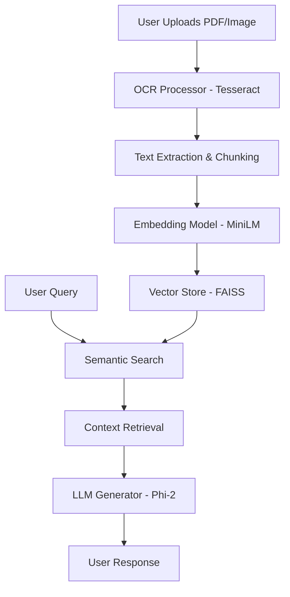

# 🤖 Multilingual RAG Chatbot: Document Intelligence System

[](https://www.python.org/)
[](https://fastapi.tiangolo.com/)
[](https://streamlit.io/)
[](https://huggingface.co/)
[](https://github.com/tesseract-ocr/tesseract)
[](https://github.com/UmmayMaimonaChaman/Rag-ChatBot)


Live demo : [](https://huggingface.co/spaces/Chaman5204/rag-chatbot)


An advanced **Multilingual (Bengali/Banglish & English)** Document Intelligence Assistant that leverages Retrieval-Augmented Generation (RAG) to provide contextual answers from uploaded PDFs and images.

---

## 🌟 Project Overview

This project develops a complete RAG pipeline designed for bilingual document understanding. It extracts text from complex documents (including images and PDFs) using OCR and indexed them using FAISS. Users can interact with their documents in natural language, receiving precise, context-aware responses in both English and Bengali.

### 🎯 Key Features
- **🌍 Bilingual Support**: Seamlessly handles Bengali/Banglish and English documents and queries.
- **📄 Multimodal Extraction**: Utilizes Tesseract OCR for high-quality text extraction from images and PDFs.
- **⚡ High-Performance Indexing**: Powered by FAISS for rapid semantic search.
- **🧠 Local LLM Integration**: Uses state-of-the-art transformer models (`microsoft/phi-2`) for response generation.
- **💻 Modern Web App**: Built with a sleek Streamlit frontend and a robust FastAPI backend.
- **🐳 Cloud Ready**: Full Docker support for easy deployment on Hugging Face Spaces.

---

## 🛠️ System Architecture



---

## 📜 Credits & Citations

This project makes extensive use of the following open-source libraries and "free-to-use" APIs/Hubs:

- **[Hugging Face Hub](https://huggingface.co/)**: Providing the pre-trained `microsoft/phi-2` LLM and embedding models.
- **[Tesseract OCR](https://github.com/tesseract-ocr/tesseract)**: For high-accuracy text extraction from images and scanned PDFs.
- **[FAISS (Facebook AI Similarity Search)](https://github.com/facebookresearch/faiss)**: For high-speed vector similarity search.
- **[LangChain](https://www.langchain.com/)**: For efficient text splitting and document handling.
- **[FastAPI](https://fastapi.tiangolo.com/)**: For a high-performance backend API.
- **[Streamlit](https://streamlit.io/)**: For the interactive user interface.

> [!NOTE]
> All models used in this project are hosted and loaded locally via Hugging Face's `transformers` library, ensuring privacy and cost-efficiency. **No private API keys are required for the standard local execution.**

---

## 🚀 Getting Started

### Prerequisites
1. **Python 3.10+**
2. **Tesseract OCR**: Install on your system with Bengali (ben) language data.
3. **Poppler**: For PDF processing.

### Installation & Run

1. **Clone & Install**:
   ```bash
   git clone https://github.com/UmmayMaimonaChaman/Rag-ChatBot.git
   cd Rag-ChatBot
   pip install -r requirements.txt
   ```

2. **Start Backend**:
   ```bash
   python backend/main.py
   ```

3. **Start Frontend**:
   ```bash
   streamlit run frontend/app.py
   ```

---

## 👩‍💻 Author

Developed by **Ummay Maimona Chaman**  
*Always learning, always building.*

---
> [!IMPORTANT]
> This project is for educational purposes. All contributions are welcome!
> i am now handling some errors.
